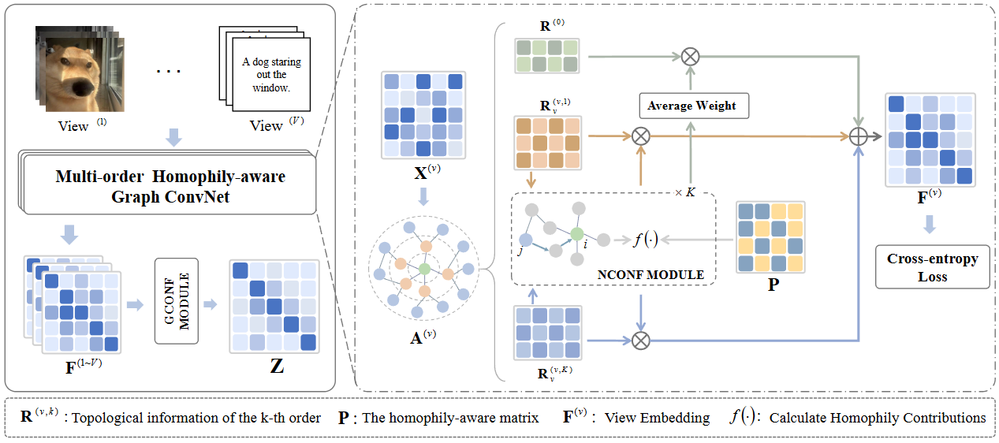

# Towards-Multi-order-Homophily-aware-Propagation-in-Multi-view-Learning

Updated .....
## Baseline Methods
- Co-GCN for Multi-View Semi-Supervised Learning
 (https://aaai.org/papers/04691-co-gcn-for-multi-view-semi-supervised-learning/)
- Learning Deep Sparse Regularizers With Applications to Multi-View Clustering and Semi-Supervised Classification
 (https://ieeexplore.ieee.org/document/9439159)
- Learnable Graph Convolutional Network and Feature Fusion
 (https://www.sciencedirect.com/science/article/abs/pii/S1566253523000532)
- Interpretable Graph Convolutional Network for Multi-view Semi-supervised Learning
 (https://ieeexplore.ieee.org/abstract/document/10080867)
- Joint learning of feature and topology for multi-view graph convolutional network
 (https://www.sciencedirect.com/science/article/abs/pii/S0893608023004987)
- Generative Essential Graph Convolutional Network for Multi-view Semi-supervised Classification
 (https://ieeexplore.ieee.org/document/10462517)
- Towards Multi-view Consistent Graph Diffusion
 (https://dl.acm.org/doi/abs/10.1145/3664647.3681258)
# Requirements:
Tested with 

  -Python 3.9
  -torch>=1.10.0
  -scipy>=1.7.3
  -scikit-learn>=1.0.2
  -numpy>=1.21.5
  -tqdm>=4.62.3
  -argparse>=1.4.0.
  -pytorch
  -numpy scipy matplotlib pyyaml


# Run the Code

### Run GCN on animals:

```
python main.py --dataset dataset --lr lr --epoch epoch --train_ratio train_ratio
```

### Run  Baselines on animals

In. `/Mv—GCN_nn_git/train.py/` the baseline model is modified in the model initialization, and the model part of the baseline model is temporarily stored in . `/MvJDR-svd/models/`.
Then:
```
python main.py --dataset dataset --lr lr --epoch epoch --train_ratio train_ratio
```

# How to use this ...

## ...with my own GNN

Add your Mv-GNN to `/Mv—GCN_nn_git/models/` and adapt the model initialization in `/Mv—GCN_nn_git/main.py/` accordingly. You can then use your GNN to test the performance of our approach, e.g. on animals with
```
python main.py --dataset dataset --lr lr --epoch epoch --train_ratio train_ratio
```

## ...with my own dataset

Modify the dataset path in `. /Mv—GCN_nn_git/main.py` in the LoadMatData code section passing parameters.

## Citation
Updated .....

